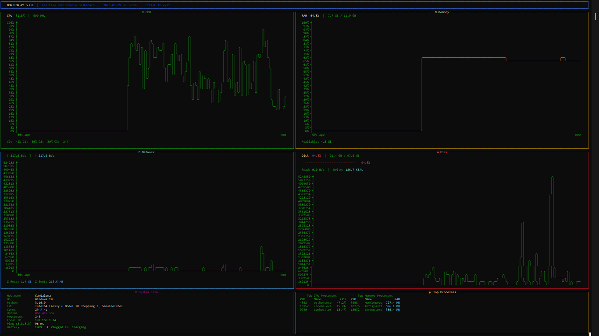

# 🖥️ Monitor-PC

**Realtime PC/Laptop Performance Dashboard** — a cross-platform Python CLI tool that transforms your terminal into a live system monitor, inspired by Task Manager's Performance tab.


---

## ✨ Features

| Feature | Description |
|---------|-------------|
| **CPU Monitoring** | Total + per-core usage with realtime sparkline graph |
| **RAM Monitoring** | Usage percentage, used/total/available with realtime sparkline graph |
| **Disk Usage** | Progress bar with used/free space details |
| **Network Speed** | Live upload & download speed + total transferred |
| **Battery Status** | Percentage, charging state, and time remaining |
| **System Info** | Hostname, OS, CPU model, core count, uptime, process count |
| **Realtime Graphs** | 60-second rolling sparkline charts for CPU & RAM |
| **Color Coding** | 🟢 Green (normal) → 🟡 Yellow (moderate) → 🔴 Red (high) |

---

## 📦 Installation

### 1. Clone or download the project

```bash
cd Monitoring-pc
```

### 2. Install dependencies

```bash
pip install -r requirements.txt
```

### 3. Run the dashboard

```bash
python monitor_pc.py
```

---

## 🖥️ Dashboard Preview



---

## 🛠️ Technical Details

- **Refresh rate:** 1 second
- **Graph history:** 60 data points (rolling window)
- **CPU data:** `psutil.cpu_percent()` (total + per-core)
- **RAM data:** `psutil.virtual_memory()`
- **Disk data:** `psutil.disk_usage()` (auto-detects `C:\` on Windows, `/` on Linux/macOS)
- **Network speed:** Calculated from delta of `psutil.net_io_counters()` per second
- **Battery:** `psutil.sensors_battery()` (shows "Not available" if no battery)
- **Rendering:** Rich `Live` display — updates in-place, no terminal flickering

---

## 📁 Project Structure

```
Monitoring-pc/
├── monitor_pc.py       # Main dashboard application
├── requirements.txt    # Python dependencies
└── README.md           # This file
```

---

## ⌨️ Controls

| Key | Action |
|-----|--------|
| `Ctrl+C` | Gracefully stop the dashboard |

---

## 📋 Requirements

- **Python** 3.7+
- **psutil** ≥ 5.9.0
- **rich** ≥ 13.0.0

---

## 🐛 Troubleshooting

| Issue | Solution |
|-------|----------|
| Battery shows "Not available" | Normal for desktops without a battery |
| Garbled characters in graph | Use a terminal with Unicode support (Windows Terminal, iTerm2, etc.) |
| Permission errors on Linux | Some metrics may require `sudo` on certain distros |
| Flickering display | Ensure your terminal supports alternate screen mode |

---

## 📄 License

MIT License — free to use, modify, and distribute.
